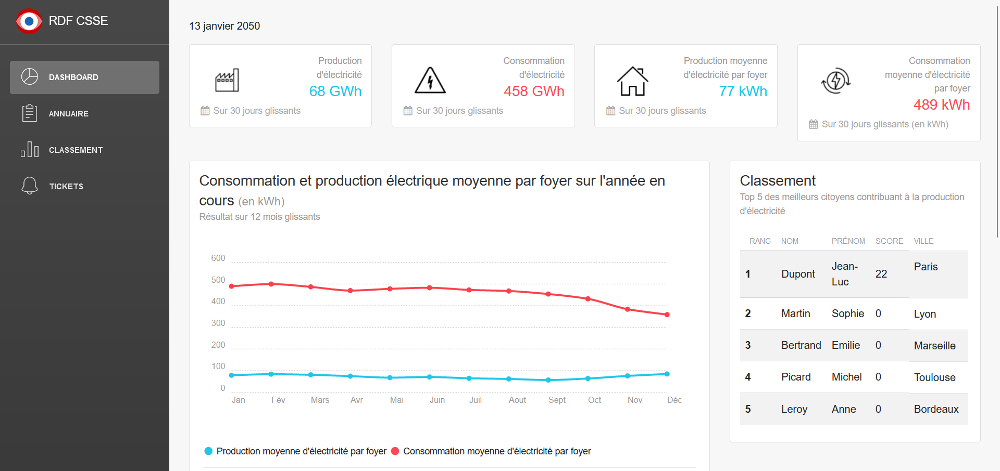

# [RDF CSSE DASHBOARD](https://github.com/ensicaen-rdf/rdf-dashboard) [![version][version-badge]][changelog] [![license][license-badge]][license]

> Admin RDF CSSE dashboard

This project is a vue version of [RDF CSSE Dashboard](https://github.com/ensicaen-rdf/rdf-dashboard)
designed for vue js. The dashboard includes Bootstrap 4, vue-router, chartist, leaflet and several other plugins/components.

Check the [Live Demo here](https://intensif06.ensicaen.fr/dashboard/).

## :rocket: Getting started

RDF CSSE Dashboard is built on top of Bootstrap 4, Vuejs and Vue-router. To get started do the following steps:

1. Download the project
2. Make sure you have node.js (https://nodejs.org/en/) installed
3. Type `npm install` in the source folder where `package.json` is located
4. Type `npm run serve` to start the development server

The repo uses [vue-cli](https://github.com/vuejs/vue-cli) scaffolding which takes care of the development setup with webpack and all the necessary modern tools to make web development faster and easier.

## [Documentation (site de la RDF)](https://intensif06.ensicaen.fr)

## :cloud: Build Setup

### install dependencies

`npm install`

### serve with hot reload at localhost:8000

`npm run serve`

### build for production with minification

`npm run build`

[changelog]: ./CHANGELOG.md
[license]: ./LICENSE.md
[version-badge]: https://img.shields.io/badge/version-2.1.0-blue.svg
[license-badge]: https://img.shields.io/badge/license-MIT-blue.svg
